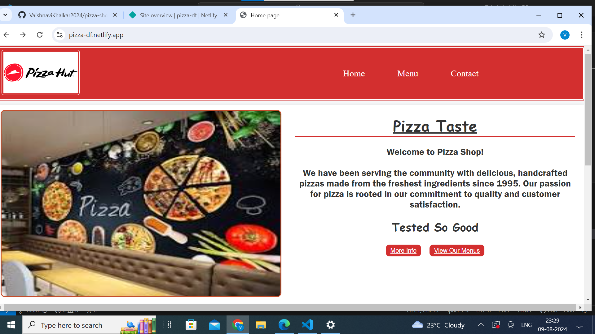
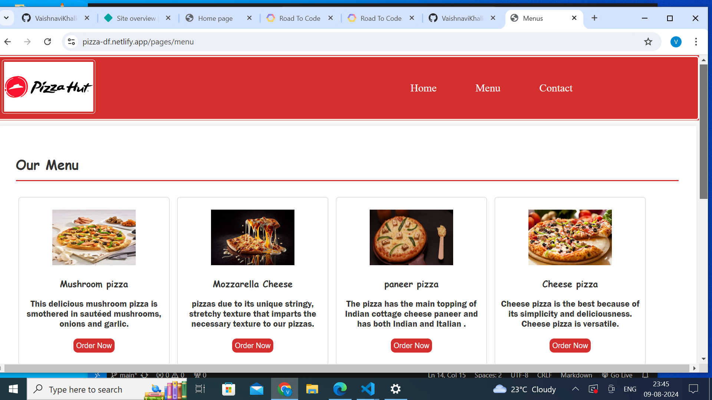
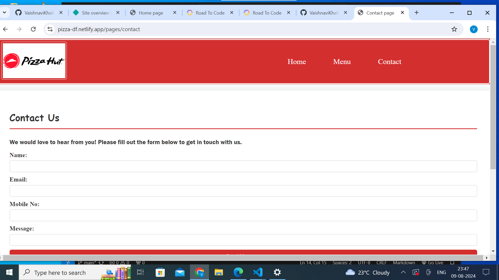

# Pizza hub

Welcome to **Pizza hub !**

This is open-source **dummy project i.e (just for practice)**
information about pizza menus like
home ,contact and many more etc.

Website URL : [visit our website](https://pizza-df.netlify.app/)

We have various pages in this websites are as follows :

- **Home**
- **Contact Us**
- **Menus**

## **Home Page**

## Information About Home Page

- **Page Link** : [Visit Home Page](https://pizza-df.netlify.app/).
- **Summery Of Page** : This is an Home Page. This is an main entry page of our website.
  This page content information about  pizza tests and its services.
- **Language Used** : HTML 5 ,css.

## **Menu Page**

## Information about Menu page

- **Page Link** : [Visit Menu Page](https://pizza-df.netlify.app/pages/menu) .
- **Summery Of Page** : This is Menu  Page.This page content information about  different type of pizza and its menus cards.
- **Language Used** : HTML 5,css

## **Contact Page**

## Information about Contact page

- **Page Link** : [Visit Contact Page](https://pizza-df.netlify.app/pages/contact) .
- **Summery Of Page** : This is an Contact Page.This page content information about user send massege this type of services available also etc .
- **Language Used** : HTML 5 ,css

